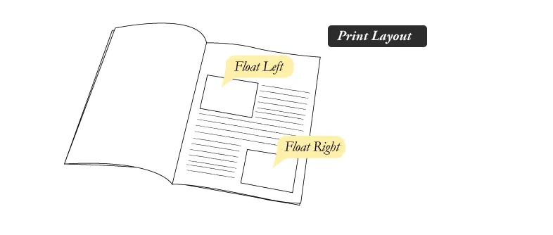

# Shay Howe's intro to Responsive Web Design
## Source: https://learn.shayhowe.com/advanced-html-css/responsive-web-design/

## Responsive Overview

- Responsive web design is the practice of building a website suitable to work on every device and every screen size, no matter how large or small, mobile or desktop.

- The responsive web design term itself was coined, and largely developed, by Ethan Marcotte.

## Flexible Layout

- Responsive web design is broken down into three main components, including flexible layouts, media queries, and flexible media. The first part, flexible layouts, is the practice of building the layout of a website with a flexible grid, capable of dynamically resizing to any width. Flexible grids are built using relative length units, most commonly percentages or em units. These relative lengths are then used to declare common grid property values such as width, margin, or padding.

- Flexible layouts do not advocate the use of fixed measurement units, such as pixels or inches. Reason being, the viewport height and width continually change from device to device. Website layouts need to adapt to this change and fixed values have too many constraints. Fortunately, Ethan pointed out an easy formula to help identify the proportions of a flexible layout using relative values.

## Media Queries

- Were built as an extension to media types commonly found when targeting and including styles. Media queries provide the ability to specify different styles for individual browser and device circumstances, the width of the viewport or device orientation for example. Being able to apply uniquely targeted styles opens up a world of opportunity and leverage to responsive web design.

## Flexible Media

- As viewports begin to change size media doesn’t always follow suit. Images, videos, and other media types need to be scalable, changing their size as the size of the viewport changes.

One quick way to make media scalable is by using the max-width property with a value of 100%. Doing so ensures that as the viewport gets smaller any media will scale down according to its containers width.

---

# All About Float

## Source: https://css-tricks.com/all-about-floats/

## What is "Float"?

- Float is a CSS positioning property. To understand its purpose and origin, we can look to print design. In a print layout, images may be set into the page such that text wraps around them as needed. This is commonly and appropriately called “text wrap”.

