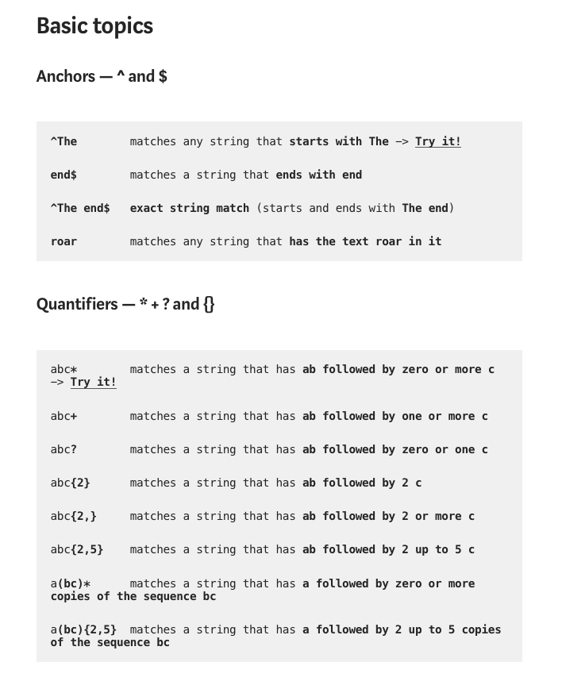
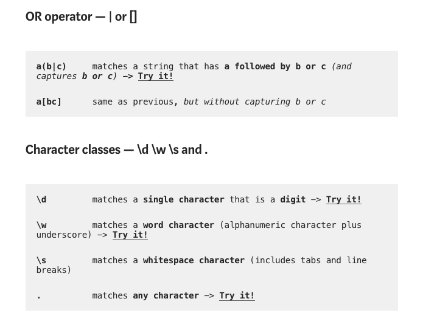
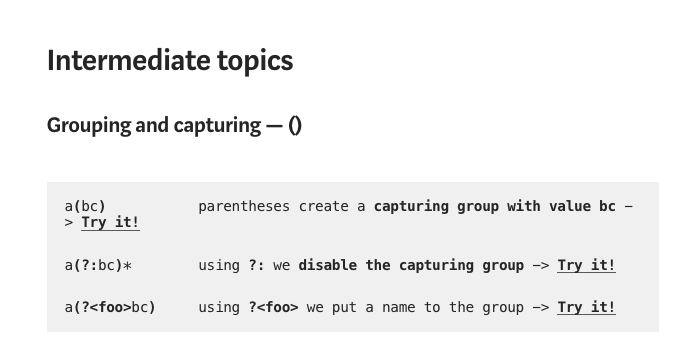
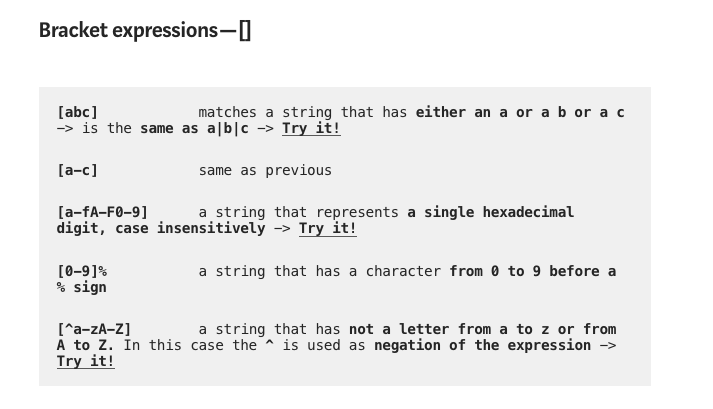
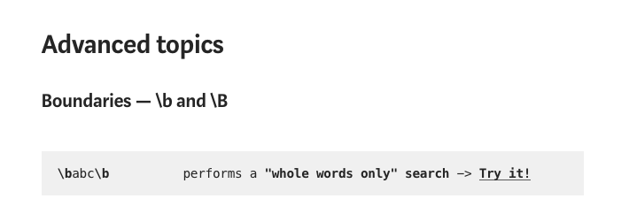
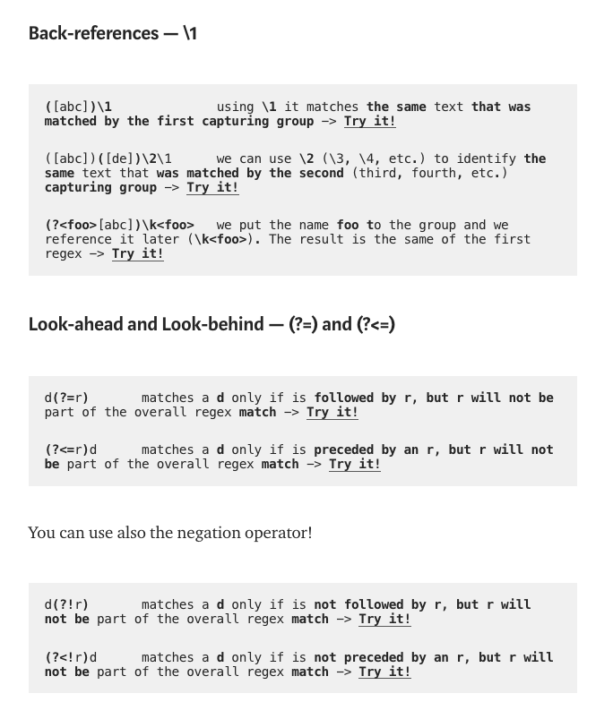

# CSS GRID

## [Regex tutorial — A quick cheatsheet by examples](https://medium.com/factory-mind/regex-tutorial-a-simple-cheatsheet-by-examples-649dc1c3f285)

### By Jonny Fox

- Regular expressions (regex or regexp) are extremely useful in extracting information from any text by searching for one or more matches of a specific search pattern (i.e. a specific sequence of ASCII or unicode characters).

- Fields of application range from validation to parsing/replacing strings, passing through translating data to other formats and web scraping.

---

## [A Complete Guide to Grid](https://css-tricks.com/snippets/css/complete-guide-grid/)

### By CSS-TRICKS

- CSS Grid Layout is the most powerful layout system available in CSS. It is a 2-dimensional system, meaning it can handle both columns and rows, unlike flexbox which is largely a 1-dimensional system. You work with Grid Layout by applying CSS rules both to a parent element (which becomes the Grid Container) and to that element’s children (which become Grid Items).

- It's better to see the article to view the well detailed guide. Click the article name above to see the article.