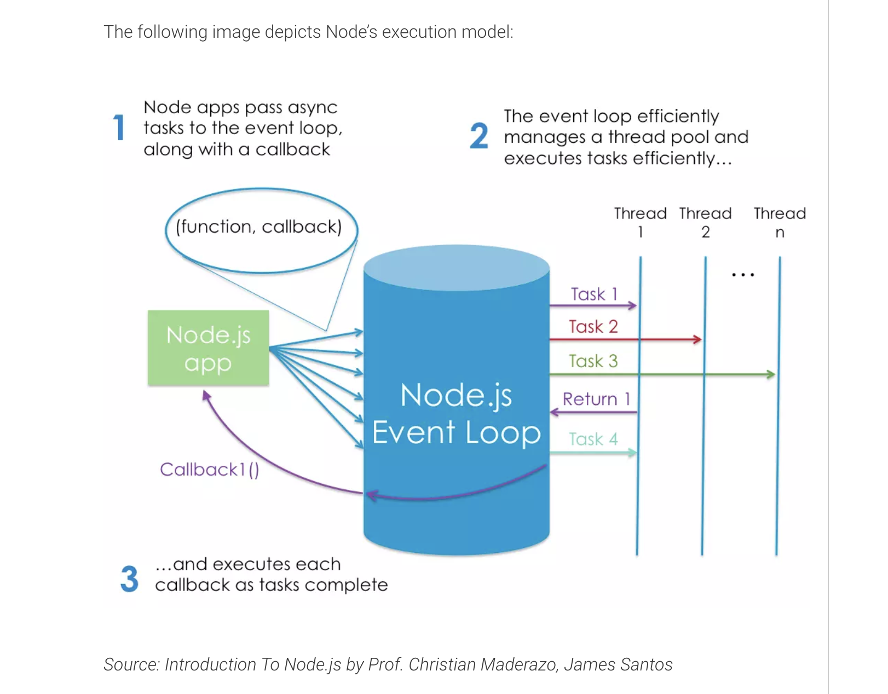

# Node, Express, and APIs

## [What Is Node and When Should I Use It?](https://www.sitepoint.com/an-introduction-to-node-js/)

### By James Hibbard

- **What is Node.js**

  - Node.js® is a JavaScript runtime built on Chrome’s V8 JavaScript engine.(https://nodejs.org/en/)

  - Node.js is an event-based, non-blocking, asynchronous I/O runtime that uses Google’s V8 JavaScript engine and libuv library. (stack overflow)

  - Node Is Built on Google Chrome’s V8 JavaScript Engine

    - The V8 engine is the open-source JavaScript engine that runs in Google Chrome and other Chromium-based web browsers, including Brave, Opera, and Vivaldi. It was designed with performance in mind and is responsible for compiling JavaScript directly to native machine code that your computer can execute.

    - However, when we say that Node is built on the V8 engine, we don’t mean that Node programs are executed in a browser. They aren’t. Rather, the creator of Node (Ryan Dahl) took the V8 engine and enhanced it with various features, such as a file system API, an HTTP library, and a number of operating system–related utility methods.

  - This means that Node.js is a program we can use to execute JavaScript on our computers. In other words, it’s a JavaScript runtime.

- **What Is Node.js Used For?**

  -  They can be used for anything from bundling your JavaScript files and dependencies into static assets, to running tests, or automatic code linting and style checking.

  - And if you want to start developing apps with any modern JavaScript framework (for example, React or Angular), you’ll be expected to have a working knowledge of Node and npm (or maybe Yarn). This isn’t because you need a Node back end to run these frameworks. You don’t. Rather, it’s because these frameworks (and many, many related packages) are all available via npm and rely on Node to create a sensible development environment in which they can run.

- **Node.js Lets Us Run JavaScript on the Server**

  

- **What Kind of Apps Is Node.js Suited To?**

  - Node is particularly suited to building applications that require some form of real-time interaction or collaboration — for example, chat sites, or apps such as CodeShare, where you can watch a document being edited live by someone else. It’s also a good fit for building APIs where you’re handling lots of requests that are I/O driven (such as those needing to perform operations on a database), or for sites involving data streaming, as Node makes it possible to process files while they’re still being uploaded. If this real-time aspect of Node is something you’d like to look into more, check out our tutorial on Building a Real-time Chat App.

- **What Are the Advantages of Node.js?**

  - Aside from speed and scalability, an often-touted advantage of using JavaScript on a web server — as well as in the browser — is that your brain no longer needs to switch modes. You can do everything in the same language, which, as a developer, makes you more productive (and hopefully, happier). For example, you can easily share code between the server and the client.

  - Another of Node’s big pluses is that it speaks JSON. JSON is probably the most important data exchange format on the Web, and the lingua franca for interacting with object databases (such as MongoDB). JSON is ideally suited for consumption by a JavaScript program, meaning that when you’re working with Node, data can flow neatly between layers without the need for reformatting. You can have one syntax from browser to server to database.

  - Finally, JavaScript is ubiquitous: most of us are familiar with JavaScript, or have used it at some point. This means that transitioning to Node development is potentially easier than to other server-side languages. To quote Craig Buckler in his Node vs PHP Smackdown, JavaScript might remain the world’s most misunderstood language — but, once the concepts click, it makes other languages seem cumbersome.

- **Other Uses of Node**

  - And it doesn’t stop at the server. There are many other exciting and varied uses of Node.js!

  - For example it can be used as a scripting language to automate repetitive or error prone tasks on your PC. It can also be used to write your own command line tool, such as this Yeoman-Style generator to scaffold out new projects.

  - Node.js can also can be used to build cross-platform desktop apps and even to create your own robots. What’s not to love?

--- 

